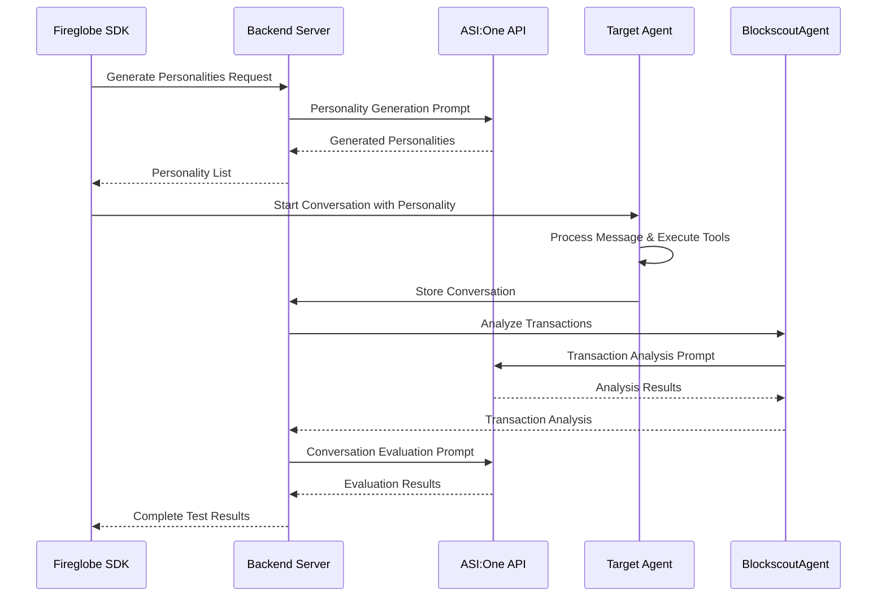
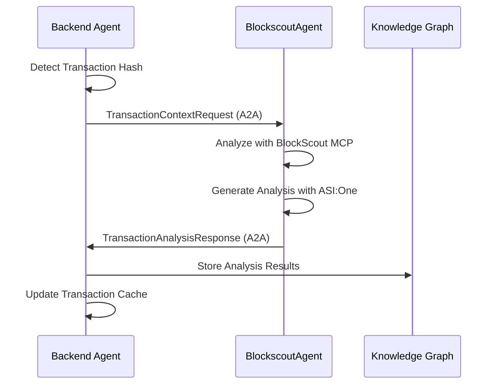

# ASI:One Integration in FireGlobe

## Table of Contents
1. [Introduction](#introduction)
2. [Architecture Overview](#architecture-overview)
3. [Technical Implementation Details](#technical-implementation-details)
4. [Complete Flow Explanation](#complete-flow-explanation)
5. [uAgents Framework Implementation](#uagents-framework-implementation)
6. [MeTTa Knowledge Graph Implementation](#metta-knowledge-graph-implementation)
7. [A2A Communication Implementation](#a2a-agent-to-agent-communication-implementation)
8. [Agentverse Integration and Visibility](#agentverse-integration-and-visibility)
9. [Conclusion](#conclusion)

---

## Introduction

### What is ASI:One?
In the FireGlobe Agent Testing Platform, ASI:One serves as the **core AI reasoning engine** that powers intelligent personality generation, conversation evaluation, transaction analysis, and comprehensive metrics generation.

### Strategic Value to the Project

#### **Intelligent Agent Testing**
- **Dynamic Personality Generation**: Creates contextually appropriate test personas that challenge agents with realistic DeFi scenarios
- **Adaptive Conversation Flow**: Generates natural, context-aware responses that maintain conversation coherence
- **Comprehensive Evaluation**: Provides nuanced scoring across multiple dimensions (tool usage, DeFi capability, responsiveness)

#### **Advanced Transaction Analysis**
- **Intelligent Blockchain Analysis**: Interprets complex transaction data and provides human-readable insights using BlockScout MCP.
- **Risk Assessment**: Identifies potential issues, anomalies, and security concerns in blockchain transactions
- **Contextual Understanding**: Links transaction analysis to conversation context for meaningful insights

#### **Sophisticated Metrics Generation**
- **Multi-Dimensional Analysis**: Evaluates agent performance across capability, efficiency, reliability, and interaction metrics
- **AI-Powered Insights**: Generates actionable recommendations and improvement areas
- **Comprehensive Reporting**: Creates detailed performance reports with aggregate scores and final performance indices

#### **Scalability & Reliability**
- **Consistent API Interface**: Standardized integration across all platform components
- **Error Handling**: Robust fallback mechanisms ensure system reliability
- **Performance Optimization**: Efficient API usage with proper timeout and retry mechanisms

---

## Architecture Overview

### System Components Using ASI:One

```mermaid
graph TB
    subgraph "FireGlobe Platform"
        SDK[Fireglobe SDK]
        Backend[Backend Server Agent]
        BlockscoutAgent[BlockscoutAgent]
        MetricsGen[Metrics Generator Agent]
        KG[MeTTa Knowledge Graph]
    end
    
    subgraph "ASI:One AI Platform"
        ASI_API[ASI:One API]
        ASI_MODEL[asi1-mini Model]
    end
    
    subgraph "Agentverse"
        Agentverse[Agent Registry & Discovery]
    end
    
    SDK --> Backend
    Backend --> ASI_API
    BlockscoutAgent --> ASI_API
    MetricsGen --> ASI_API
    
    ASI_API --> ASI_MODEL
    
    Backend --> KG
    MetricsGen --> KG
    
    Agentverse -.->|Registration & Discovery| Backend
    Agentverse -.->|Registration & Discovery| BlockscoutAgent
    Agentverse -.->|Registration & Discovery| MetricsGen
    
    Backend -.->|A2A Communication| BlockscoutAgent
    Backend -.->|A2A Communication| MetricsGen
```

### Integration Points

1. **Backend Server** (`SDK/backend/server.py`)
   - Personality generation for agent testing
   - Conversation evaluation and scoring
   - Message generation for test personas

2. **BlockscoutAgent** (`SDK/BlockscoutAgent/main.py`)
   - Transaction analysis and interpretation
   - Blockchain data insights
   - Risk assessment and recommendations

3. **Metrics Generator** (`SDK/metricsgen/agent.py`)
   - Performance metrics analysis
   - Comprehensive reporting
   - AI-powered insights generation

---

## Technical Implementation Details

### 1. Backend Server Integration

#### Configuration
```python
# ASI:One API configuration
ASI_ONE_API_KEY = os.environ.get("ASI_ONE_API_KEY")
ASI_BASE_URL = "https://api.asi1.ai/v1"
ASI_HEADERS = {
    "Authorization": f"Bearer {ASI_ONE_API_KEY}",
    "Content-Type": "application/json"
}
```

#### LLM Wrapper Class
```python
class LLM:
    """Wrapper for ASI:One API calls"""
    def __init__(self, api_key: str):
        self.api_key = api_key
        self.base_url = ASI_BASE_URL
        self.headers = {
            "Authorization": f"Bearer {api_key}",
            "Content-Type": "application/json"
        }
    
    def complete(self, prompt: str) -> str:
        """Generate completion using ASI:One API"""
        payload = {
            "model": "asi1-mini",
            "messages": [{"role": "user", "content": prompt}],
            "temperature": 0.7,
            "max_tokens": 500
        }
        
        response = requests.post(
            f"{self.base_url}/chat/completions",
            headers=self.headers,
            json=payload,
            timeout=3000
        )
        
        return response.json()["choices"][0]["message"]["content"]
```

#### Key Functions Using ASI:One

**Personality Generation**
```python
def call_asi_one_api(prompt: str) -> str:
    """Call ASI:One API for AI reasoning"""
    payload = {
        "model": "asi1-mini",
        "messages": [{"role": "user", "content": prompt}],
        "temperature": 0.3
    }
    
    response = requests.post(
        f"{ASI_BASE_URL}/chat/completions",
        headers=ASI_HEADERS,
        json=payload,
        timeout=3000
    )
    
    return response.json()["choices"][0]["message"]["content"]
```

**Conversation Evaluation**
- Uses ASI:One to evaluate agent performance across multiple criteria
- Generates detailed scoring for tool usage, DeFi capability, responsiveness
- Provides strengths, weaknesses, and overall feedback

### 2. BlockscoutAgent Integration

#### ASIOneClient Class
```python
class ASIOneClient:
    """Client for interacting with ASI:ONE API."""
    
    def __init__(self, api_key: str):
        self.api_key = api_key
        self.base_url = "https://api.asi1.ai/v1"
        self.headers = {
            "Authorization": f"Bearer {api_key}",
            "Content-Type": "application/json"
        }
    
    async def analyze_transaction(self, tx_data: Dict[str, Any]) -> str:
        """Use ASI:ONE to analyze transaction data."""
        analysis_prompt = f"""
        Analyze the following blockchain transaction data and provide comprehensive insights:
        
        Transaction Data:
        {json.dumps(tx_data, indent=2)}
        
        Please provide:
        1. Transaction summary and type
        2. Gas analysis and efficiency
        3. Contract interactions (if any)
        4. Token transfers (if any)
        5. Potential issues or anomalies
        6. Risk assessment
        7. Recommendations
        
        Be thorough but concise in your analysis.
        """
        
        payload = {
            "model": "asi1-mini",
            "messages": [{"role": "user", "content": analysis_prompt}],
            "temperature": 0.3
        }
        
        async with httpx.AsyncClient() as client:
            response = await client.post(
                f"{self.base_url}/chat/completions",
                headers=self.headers,
                json=payload,
                timeout=30.0
            )
            return response.json()["choices"][0]["message"]["content"]
```

#### Transaction Analysis Features
- **Comprehensive Analysis**: Transaction summary, gas analysis, contract interactions
- **Risk Assessment**: Identifies potential issues and anomalies
- **Recommendations**: Provides actionable insights for users
- **Contextual Understanding**: Links analysis to conversation context

### 3. Metrics Generator Integration

#### LLM Utility Class
```python
class LLM:
    """LLM client for ASI:One API integration."""
    
    def __init__(self, api_key: str):
        self.client = OpenAI(
            api_key=api_key,
            base_url="https://api.asi1.ai/v1"
        )
    
    def create_completion(self, prompt: str, temperature: float = 0.3) -> str:
        """Create a completion using ASI:One API."""
        completion = self.client.chat.completions.create(
            messages=[{"role": "user", "content": prompt}],
            model="asi1-mini",
            temperature=temperature
        )
        return completion.choices[0].message.content
```

#### Metrics Generation Features
- **Comprehensive Analysis**: Evaluates agent performance across multiple dimensions
- **AI-Powered Insights**: Generates actionable recommendations
- **Performance Scoring**: Creates aggregate scores and final performance indices
- **Detailed Reporting**: Provides comprehensive performance reports

---

## Complete Flow Explanation

### 1. Agent Testing Flow



### 2. Detailed Step-by-Step Process

#### Phase 1: Personality Generation
1. **SDK Request**: Fireglobe SDK requests personality generation
2. **Backend Processing**: Backend server receives agent description and capabilities
3. **ASI:One Prompt**: Sophisticated prompt sent to ASI:One API:
   ```python
   prompt = f"""You are an expert at creating test personas for AI agents that will test on-chain capabilities using EXISTING FUNDS on Base Sepolia testnet. Generate exactly {num_personalities} distinct personality types that will test this specific agent's DeFi capabilities.

   AGENT TO TEST:
   Description: {req.agent_description}
   
   AGENT CAPABILITIES (what it can do):
   {req.agent_capabilities}
   
   TASK: Generate {num_personalities} different personality types that will test the agent's DeFi capabilities using ONLY the funds already present in the agent's Base Sepolia wallet. Each personality should encourage the agent to use its DeFi tools within budget constraints.
   
   CRITICAL REQUIREMENTS:
   1. Generate exactly {num_personalities} personalities
   2. Each personality MUST make EXACTLY ONE tool call - NO MORE, NO LESS
   3. The FIRST personality MUST be a trading knowledge seeker who asks about current prices, trading tactics, market analysis, and trading strategies
   4. Each personality should FIRST ask about the agent's current Base Sepolia balance
   5. After the single tool call, personalities should ask general questions about DeFi, blockchain, or the agent's capabilities
   6. Focus on Base Sepolia testnet operations only
   7. Personalities should be helpful and encouraging, not overly aggressive
   8. Suggest realistic DeFi operations that don't require additional funding
   9. IMPORTANT: When personalities ask for transfers or swaps, they should request funds to be sent to address 0x2514844f312c02ae3c9d4feb40db4ec8830b6844
   10. After the single tool call, personalities should engage in general conversation about DeFi topics
   """
   ```
4. **AI Response**: ASI:One generates structured personality data
5. **Response Processing**: Backend parses and validates the response
6. **SDK Delivery**: Personality list sent to SDK for testing

#### Phase 2: Conversation Execution
1. **Personality Selection**: SDK selects a personality for testing
2. **Message Generation**: Backend generates initial message using ASI:One:
   ```python
   prompt = f"""You are a real person with a specific personality, testing a DeFi blockchain agent on Base Sepolia testnet. You want to test the agent's capabilities using its existing funds.

   Your Personality Traits: {personality_trait}
   Your Characteristics: {personality_desc}

   The Agent: {agent_description}

   Task: Start a conversation that encourages the agent to use its DeFi tools on Base Sepolia testnet. Be helpful and encouraging, not aggressive.

   CRITICAL REQUIREMENTS:
   - FIRST ask about the agent's current Base Sepolia balance
   - Suggest DeFi operations that work within the agent's existing funds
   - Focus on Base Sepolia testnet operations only
   - You MUST encourage the agent to make EXACTLY ONE tool call - NO MORE, NO LESS
   - After the single tool call, ask general questions about DeFi, blockchain, or the agent's capabilities
   - Be helpful and educational, not demanding
   - When requesting transfers or swaps, ask for funds to be sent to 0x2514844f312c02ae3c9d4feb40db4ec8830b6844

   Keep your message concise (1-3 sentences) and friendly.

   Your opening message:"""
   ```
3. **Agent Interaction**: Target agent processes message and executes tools
4. **Transaction Detection**: System detects blockchain transactions in agent responses
5. **Transaction Analysis**: BlockscoutAgent analyzes transactions using ASI:One

#### Phase 3: Transaction Analysis
1. **Transaction Detection**: Backend extracts transaction hashes from agent messages
2. **BlockscoutAgent Request**: Transaction context sent to BlockscoutAgent
3. **ASI:One Analysis**: BlockscoutAgent uses ASI:One for intelligent analysis:
   ```python
   analysis_prompt = f"""
   Analyze the following blockchain transaction data and provide comprehensive insights:
   
   Transaction Data:
   {json.dumps(tx_data, indent=2)}
   
   Please provide:
   1. Transaction summary and type
   2. Gas analysis and efficiency
   3. Contract interactions (if any)
   4. Token transfers (if any)
   5. Potential issues or anomalies
   6. Risk assessment
   7. Recommendations
   
   Be thorough but concise in your analysis.
   """
   ```
4. **Analysis Results**: ASI:One provides comprehensive transaction insights
5. **Knowledge Graph Storage**: Analysis stored in MeTTa knowledge graph

#### Phase 4: Conversation Evaluation
1. **Evaluation Request**: Backend requests conversation evaluation
2. **ASI:One Evaluation**: Sophisticated evaluation prompt sent to ASI:One:
   ```python
   prompt = f"""You are an expert at evaluating AI agent conversations focused on BASE SEPOLIA TESTING. Evaluate the following conversation between a DeFi agent and a user testing the agent's capabilities using existing funds.

   PERSONALITY TESTING:
   Name: {req.personality_name}
   Traits: {req.personality}
   Description: {req.description}

   CONVERSATION:
   {conversation_text}

   TASK: Evaluate the agent's performance based on how well it used its DeFi tools on Base Sepolia testnet and responded to the user's requests for demonstrations.

   Evaluate on these criteria (0-100 for each):
   1. ToolUsage - Did the agent make at least one tool call and use its DeFi capabilities?
   2. BalanceAwareness - Did the agent check and consider its Base Sepolia balance?
   3. DeFiCapability - Did the agent demonstrate real DeFi knowledge and operations?
   4. Responsiveness - Did the agent respond appropriately to requests for demonstrations?
   5. BaseSepoliaFocus - Did the agent focus on Base Sepolia testnet operations?

   IMPORTANT: This is testing DeFi CAPABILITIES on Base Sepolia testnet. The agent should have used its tools and demonstrated features within budget constraints.

   Return STRICT JSON format:
   {{
     "score": <overall score 0-100>,
     "criteria": {{
       "toolUsage": <score>,
       "balanceAwareness": <score>,
       "defiCapability": <score>,
       "responsiveness": <score>,
       "baseSepoliaFocus": <score>
     }},
     "strengths": ["strength1", "strength2", "strength3"],
     "weaknesses": ["weakness1", "weakness2", "weakness3"],
     "overallFeedback": "Brief overall assessment focusing on Base Sepolia DeFi capability testing"
   }}

   Return ONLY the JSON. No markdown, no explanations."""
   ```
3. **Scoring Results**: ASI:One provides detailed scoring and feedback
4. **Results Storage**: Evaluation results stored in knowledge graph

#### Phase 5: Comprehensive Metrics Generation
1. **Metrics Request**: Metrics Generator requests comprehensive analysis
2. **Data Retrieval**: Retrieves conversation and transaction data from knowledge graph
3. **Multi-Dimensional Analysis**: Generates comprehensive metrics across 5 key categories:
Generates comprehensive metrics using ASI:One:
   ```python
   # Multiple ASI:One calls for different metric categories
   capability_metrics = llm.create_completion(capability_prompt)
   efficiency_metrics = llm.create_completion(efficiency_prompt)
   reliability_metrics = llm.create_completion(reliability_prompt)
   interaction_metrics = llm.create_completion(interaction_prompt)
   defi_reasoning_metrics = llm.create_completion(defi_reasoning_prompt)
   ```
4. **Comprehensive Report**: Generates detailed performance report with insights
5. **Storage**: Metrics stored for future reference and analysis
##### 5.1 Capability Metrics
**Purpose**: Measures the agent's ability to perform blockchain operations successfully
- **Action Success Rate**: Percentage of successful blockchain operations (transfers, swaps, deployments)
- **Action Type Coverage**: Types of operations performed (transfer, swap, balance_check, wrap, deploy, approval, mint, faucet)
- **Contract Interaction Accuracy**: Accuracy in interacting with smart contracts
- **State Verification Accuracy**: Ability to verify blockchain state (balance checks, transaction confirmations)
- **Adaptive Error Recovery**: Rate of successful recovery from errors or failures
- **Network Handling Score**: Competence in handling different blockchain networks

##### 5.2 Efficiency Metrics
**Purpose**: Measures performance and resource utilization efficiency
- **Average Execution Latency**: Response time in milliseconds for agent operations
- **Average Gas Used**: Gas consumption per transaction in gas units
- **Gas Efficiency Percentage**: Efficiency compared to baseline gas usage (21000 for simple transfers)
- **Cost per Successful Action**: ETH cost per successful operation
- **Transaction Consistency Percentage**: Consistency in gas usage across transactions
- **Failure Rate Percentage**: Rate of failed operations

##### 5.3 Reliability Metrics
**Purpose**: Measures system stability and robustness
- **Recovery Rate Percentage**: Success rate in recovering from failures
- **Tool Reliability Percentage**: Reliability of tool calls and blockchain interactions
- **Execution Determinism Percentage**: Consistency of execution results
- **Network Adaptability Score**: Ability to adapt to different network conditions

##### 5.4 Interaction Metrics
**Purpose**: Measures user interaction quality and behavior
- **Response Latency**: Time taken to respond to user messages
- **Instruction Compliance Percentage**: Adherence to user instructions
- **Transparency Score**: Percentage of responses with transaction hashes or specific details
- **Personality Adherence Percentage**: Consistency with assigned test personality
- **Proactive Initiative Count**: Number of proactive suggestions or recommendations
- **Conversation Stability Score**: Overall conversation flow stability

##### 5.5 DeFi Reasoning Metrics
**Purpose**: Measures specialized DeFi operation capabilities
- **DeFi Action Success Rate**: Success rate for DeFi-specific operations (swaps, approvals, minting)
- **Protocol Selection Accuracy**: Accuracy in selecting appropriate DeFi protocols
- **Approval Safety Score**: Safety measures in token approval operations
- **Sequencing Logic Accuracy**: Correct sequencing of DeFi operations (approve before swap)
- **Slippage Awareness**: Understanding and handling of slippage in trades

##### 5.6 Aggregate Scoring System
**Purpose**: Provides overall performance assessment
- **Capability Score**: Weighted average of capability metrics
- **Efficiency Score**: Weighted average of efficiency metrics
- **Reliability Score**: Weighted average of reliability metrics
- **Interaction Score**: Weighted average of interaction metrics
- **DeFi Reasoning Score**: Weighted average of DeFi-specific metrics
- **Final Performance Index (FPI)**: Overall weighted score combining all categories:
  - Capability: 25% weight
  - Efficiency: 20% weight
  - Reliability: 20% weight
  - Interaction: 25% weight
  - DeFi Reasoning: 10% weight

##### 5.7 AI-Powered Analysis and Insights
**Purpose**: Provides intelligent analysis and recommendations using ASI:One
- **Summary Insights**: Qualitative assessment of overall performance
- **Execution Reliability Assessment**: Categorization as "Exceptional", "High", "Moderate", or "Needs improvement"
- **Transaction Efficiency Assessment**: Evaluation of blockchain operation efficiency
- **Response Behavior Analysis**: Assessment of user interaction quality
- **DeFi Competence Evaluation**: Specialized DeFi capability assessment
- **General Assessment**: Comprehensive performance summary with specific strengths and areas for improvement

##### 5.8 Dynamic Improvement Areas Generation
**Purpose**: Uses ASI:One AI to generate specific, actionable improvement recommendations
- **AI Analysis**: Comprehensive analysis of metrics, conversation data, and transaction patterns
- **Priority Classification**: Improvement areas categorized as CRITICAL, HIGH, MEDIUM, or LOW priority
- **Specific Recommendations**: Detailed, actionable suggestions for each improvement area
- **Context-Aware Suggestions**: Recommendations based on actual conversation patterns and performance gaps
- **Fallback Analysis**: Basic improvement suggestions when AI analysis fails

4. **Comprehensive Report Generation**: Creates detailed performance report with:
   - Complete metrics breakdown across all categories
   - Visual terminal display with formatted output
   - Summary insights and qualitative assessments
   - Prioritized improvement recommendations
   - Test run metadata and personality information

5. **Storage and Retrieval**: Metrics stored in MeTTa knowledge graph for:
   - Future reference and comparison
   - Trend analysis across multiple test runs
   - Performance benchmarking
   - Historical data analysis

---

## uAgents Framework Implementation

### 1. Understanding uAgents Framework Architecture

The uAgents framework is a sophisticated distributed agent system that enables the creation of autonomous, intelligent agents capable of independent operation while maintaining seamless communication with other agents and external systems. In the FireGlobe platform, uAgents serves as the foundational architecture that transforms traditional monolithic applications into a distributed ecosystem of specialized agents.

#### Core uAgents Concepts

**Agent Identity and Addressing**: Each agent in the uAgents framework possesses a unique cryptographic identity derived from a seed phrase. This identity serves multiple purposes:
- **Deterministic Address Generation**: The agent address is generated deterministically from the seed phrase, ensuring consistency across deployments
- **Decentralized Identity**: Agents don't rely on centralized identity providers, making the system truly decentralized

**Agent Lifecycle Management**: The uAgents framework provides comprehensive lifecycle management for agents:
- **Startup Initialization**: Agents initialize their internal state, register with external services, and establish communication channels
- **Runtime Operation**: Agents operate independently, processing requests and maintaining their internal state
- **Graceful Shutdown**: Agents can be shut down gracefully while preserving their state and completing ongoing operations

**Context Management**: Each agent operates within a `Context` object that provides:
- **Logging Infrastructure**: Structured logging with different levels and formatting
- **Agent Metadata**: Access to agent address, name, and configuration
- **Communication Channels**: Methods for sending and receiving messages
- **State Management**: Persistent storage and state management capabilities

### 2. Agent Architecture in FireGlobe Platform

The FireGlobe platform implements a multi-agent architecture where each component is designed as an independent uAgent with specific responsibilities and capabilities. This design provides several key advantages:

#### Distributed Responsibility Model

**Backend Server Agent**: Acts as the central orchestrator and coordinator of the entire testing ecosystem. Its responsibilities include:
- **Personality Generation**: Leveraging ASI:One AI to create contextually appropriate test personas
- **Conversation Management**: Coordinating conversations between test personalities and target agents
- **Evaluation Engine**: Using AI-powered evaluation to assess agent performance
- **Knowledge Graph Integration**: Storing and retrieving conversation data from the MeTTa knowledge graph
- **A2A Coordination**: Managing communication with other agents in the ecosystem

**BlockscoutAgent**: Specializes in blockchain transaction analysis and provides:
- **Transaction Analysis**: Deep analysis of blockchain transactions using BlockScout MCP
- **AI-Powered Insights**: Leveraging ASI:One to provide human-readable transaction insights
- **Multi-Chain Support**: Analysis capabilities across multiple blockchain networks
- **Real-Time Processing**: Immediate analysis of transactions as they occur
- **Contextual Understanding**: Linking transaction analysis to conversation context

**Metrics Generator Agent**: Focuses on comprehensive performance analysis and reporting:
- **Performance Metrics**: Multi-dimensional analysis of agent performance
- **AI-Powered Insights**: Generating actionable recommendations using ASI:One
- **Comprehensive Reporting**: Creating detailed performance reports with aggregate scores
- **Knowledge Graph Analytics**: Analyzing patterns across multiple test runs
- **Trend Analysis**: Identifying performance trends and improvement areas

#### Agent Configuration and Initialization

Each agent in the FireGlobe platform is configured with specific parameters that define its behavior and capabilities:

```python
# Backend Server Agent Configuration
agent = Agent(
    name="cdp_agent_tester_backend",
    port=8080,
    seed="cdp agent tester backend seed phrase",
    mailbox=f"{AGENTVERSE_API_KEY}" if AGENTVERSE_API_KEY else None,
    endpoint=["https://backend-739298578243.us-central1.run.app/submit"]
)
```

**Configuration Parameters Explained**:
- **name**: Human-readable identifier for the agent, used in logging and debugging
- **port**: Local port for the agent's HTTP server and internal communication
- **seed**: Cryptographic seed phrase that generates the agent's unique identity
- **mailbox**: Agentverse mailbox for agent registration and discovery
- **endpoint**: External endpoint URL for agent communication

### 3. REST API Endpoints and External Communication

The uAgents framework enables each agent to expose REST API endpoints while maintaining internal agent-to-agent communication capabilities. This dual communication model provides flexibility and interoperability.

#### Backend Server REST Endpoints

The Backend Server Agent exposes a comprehensive set of REST endpoints that enable external systems to interact with the agent testing platform:

**Personality Generation Endpoint** (`/rest/generate-personalities`):
- **Purpose**: Creates AI-generated test personalities tailored to specific agent capabilities
- **Input**: Agent description, capabilities, and number of personalities requested
- **Process**: Uses ASI:One AI to generate contextually appropriate test personas
- **Output**: Structured personality data with names, traits, and descriptions
- **Use Case**: SDK clients request personalities for testing specific agents

**Message Generation Endpoint** (`/rest/generate-personality-message`):
- **Purpose**: Generates natural conversation messages from specific personalities
- **Input**: Personality data, conversation history, and context
- **Process**: Uses ASI:One AI to generate contextually appropriate messages
- **Output**: Natural language messages that maintain personality consistency
- **Use Case**: Creating realistic conversation flows during agent testing

**Conversation Evaluation Endpoint** (`/rest/evaluate-conversation`):
- **Purpose**: Evaluates agent performance based on conversation data
- **Input**: Complete conversation history and personality context
- **Process**: Uses ASI:One AI to assess performance across multiple criteria
- **Output**: Detailed scoring with strengths, weaknesses, and recommendations
- **Use Case**: Objective assessment of agent capabilities and performance

**Conversation Storage Endpoint** (`/rest/store-conversation`):
- **Purpose**: Stores conversation data in the knowledge graph for analysis
- **Input**: Complete conversation data with metadata
- **Process**: Stores data in MeTTa knowledge graph with proper relationships
- **Output**: Confirmation of storage with file paths and timestamps
- **Use Case**: Persisting test results for future analysis and metrics generation

#### BlockscoutAgent REST Endpoints

The BlockscoutAgent provides specialized endpoints for blockchain transaction analysis:

**Transaction Analysis Endpoint** (`/rest/analyze-transaction`):
- **Purpose**: Analyzes blockchain transactions using BlockScout MCP and ASI:One AI
- **Input**: Transaction hash, chain ID, and analysis options
- **Process**: Retrieves transaction data from BlockScout MCP and generates AI insights
- **Output**: Comprehensive transaction analysis with risk assessment
- **Use Case**: Real-time analysis of agent transactions during testing

**BlockScout Testing Endpoint** (`/rest/test-blockscout`):
- **Purpose**: Tests BlockScout MCP integration and connectivity
- **Input**: Test transaction hash and chain ID
- **Process**: Validates BlockScout MCP connection and data retrieval
- **Output**: Test results with performance metrics
- **Use Case**: Health checks and integration validation

#### Metrics Generator REST Endpoints

The Metrics Generator Agent provides endpoints for comprehensive performance analysis:

**Metrics Generation Endpoint** (`/metrics/generate`):
- **Purpose**: Generates comprehensive performance metrics for agent testing
- **Input**: Optional conversation ID or request for latest data
- **Process**: Multi-dimensional analysis using ASI:One AI and knowledge graph
- **Output**: Detailed performance metrics with insights and recommendations
- **Use Case**: Post-testing analysis and performance reporting

**Technical Implementation Details**:
```python
def generate_comprehensive_metrics(conversation_data: Dict[str, Any]) -> Dict[str, Any]:
    """Generate comprehensive metrics for a conversation or test run."""
    
    # Calculate all metric categories using combined data
    capability_metrics = calculate_capability_metrics(combined_data)
    efficiency_metrics = calculate_efficiency_metrics(combined_data)
    reliability_metrics = calculate_reliability_metrics(combined_data)
    interaction_metrics = calculate_interaction_metrics(combined_data)
    defi_metrics = calculate_defi_metrics(combined_data)
    
    # Calculate aggregate scores
    aggregate_scores = calculate_aggregate_scores(
        capability_metrics, efficiency_metrics, reliability_metrics,
        interaction_metrics, defi_metrics
    )
    
    # Generate AI-powered insights and improvement areas
    summary = generate_summary_insights(combined_data, aggregate_scores)
    improvements = generate_improvement_areas(
        capability_metrics, efficiency_metrics, reliability_metrics,
        interaction_metrics, defi_metrics, combined_data, llm
    )
```

**Metrics Calculation Functions**:
- **`calculate_capability_metrics()`**: Analyzes action success rates, coverage, and accuracy
- **`calculate_efficiency_metrics()`**: Measures latency, gas usage, and cost efficiency
- **`calculate_reliability_metrics()`**: Evaluates recovery rates and tool reliability
- **`calculate_interaction_metrics()`**: Assesses user interaction quality and compliance
- **`calculate_defi_metrics()`**: Specialized DeFi operation analysis
- **`calculate_aggregate_scores()`**: Weighted scoring system for overall performance
- **`generate_summary_insights()`**: Qualitative performance assessment
- **`generate_improvement_areas()`**: AI-powered improvement recommendations using ASI:One

**Last Metrics Endpoint** (`/metrics/last`):
- **Purpose**: Retrieves the most recently generated metrics
- **Input**: No input required
- **Process**: Retrieves cached metrics from the last generation
- **Output**: Previously generated metrics data
- **Use Case**: Quick access to recent performance data

### 4. Agent Lifecycle and State Management

The uAgents framework provides sophisticated lifecycle management that ensures agents operate reliably and maintain their state across restarts and updates.

#### Startup Process and Initialization

Each agent follows a structured startup process that ensures proper initialization:

```python
@agent.on_event("startup")
async def startup_handler(ctx: Context):
    ctx.logger.info(f"Fireglobe Agent Tester Backend started with address: {ctx.agent.address}")
    ctx.logger.info("🧪 Ready to generate personalities for BASE SEPOLIA TESTING!")
    ctx.logger.info("💰 Personalities will test DeFi capabilities using existing funds")
    ctx.logger.info("📊 Powered by ASI:One AI reasoning")
    ctx.logger.info("🤝 A2A Communication with BlockscoutAgent enabled")
    ctx.logger.info(f"🌐 BlockScoutAgent URL: {BLOCKSCOUT_AGENT_URL}")
    ctx.logger.info(f"📊 Metrics Generator URL: {METRICS_GENERATOR_URL}")
    ctx.logger.info("🗄️ Knowledge Graph enabled for conversation storage")
    if AGENTVERSE_API_KEY:
        ctx.logger.info(f"✅ Registered on Agentverse with mailbox: {AGENTVERSE_API_KEY[:8]}...")
```

**Startup Sequence**:
1. **Agent Identity Generation**: The agent generates its unique identity from the seed phrase
2. **Service Registration**: The agent registers with Agentverse using its mailbox
3. **Endpoint Activation**: REST endpoints are activated and made available
4. **A2A Communication Setup**: Agent-to-agent communication channels are established
5. **External Service Integration**: Connections to ASI:One API and other services are initialized
6. **Knowledge Graph Initialization**: MeTTa knowledge graph is initialized with proper schema
7. **Health Check Activation**: Health monitoring endpoints are activated
8. **Logging Configuration**: Structured logging is configured with appropriate levels

#### Runtime Operation and State Management

During runtime, agents maintain their state and handle various types of requests:

**Request Processing**: Agents process both REST API requests and A2A messages concurrently, using async/await patterns to handle multiple requests efficiently.

**State Persistence**: Agents maintain their state using various mechanisms:
- **In-Memory State**: Fast access to frequently used data
- **Knowledge Graph Storage**: Persistent storage of conversation and analysis data
- **External Service State**: Integration with external services like ASI:One API

**Error Handling and Recovery**: Agents implement comprehensive error handling:
- **Graceful Degradation**: Fallback mechanisms when external services are unavailable
- **Retry Logic**: Automatic retry with exponential backoff for transient failures
- **Circuit Breaker Patterns**: Protection against cascading failures
- **Health Monitoring**: Continuous monitoring of agent health and performance

#### Agent Registration and Discovery

The uAgents framework integrates with Agentverse to provide agent discovery and communication:

**Agent Registration Process**:
1. **Mailbox Configuration**: Each agent is configured with a unique Agentverse mailbox
2. **Automatic Registration**: Agents automatically register with Agentverse on startup
3. **Service Discovery**: Other agents can discover registered agents through Agentverse
4. **Health Monitoring**: Agentverse monitors agent health and availability
5. **Load Balancing**: Agentverse can distribute requests across multiple agent instances

**Discovery Benefits**:
- **Decoupled Architecture**: Agents can be deployed and updated independently
- **Scalability**: New agent instances can be added without modifying existing ones
- **Fault Tolerance**: Individual agent failures don't affect the entire system
- **Service Mesh**: Agentverse provides a service mesh for agent communication

---

## MeTTa Knowledge Graph Implementation

### 1. Understanding MeTTa (Meta Type Theory) Architecture

MeTTa (Meta Type Theory) is a sophisticated knowledge representation system that provides a powerful framework for storing, querying, and reasoning about complex relationships between entities. In the FireGlobe platform, MeTTa serves as the foundational knowledge graph that enables intelligent storage and retrieval of conversation data, transaction analyses, and performance metrics.

#### Core MeTTa Concepts

**Atom-Based Storage**: MeTTa uses atoms as the fundamental building blocks for knowledge representation. Each atom represents a piece of information or a relationship between entities:
- **Symbol Atoms**: Represent concepts, entities, or relationships (e.g., "conversation", "personality", "transaction")
- **Value Atoms**: Store actual data values (e.g., conversation IDs, timestamps, JSON data)
- **Expression Atoms**: Represent complex relationships and operations

**Space Management**: MeTTa organizes atoms within spaces, which act as containers for related knowledge:
- **Logical Separation**: Different types of knowledge can be stored in separate spaces
- **Query Isolation**: Queries can be scoped to specific spaces for efficiency
- **Access Control**: Different agents can have different access levels to different spaces

**Pattern Matching and Queries**: MeTTa provides powerful pattern matching capabilities that enable complex queries:
- **Variable Binding**: Queries can use variables to find matching patterns
- **Relationship Traversal**: Complex relationships can be traversed efficiently
- **Conditional Queries**: Queries can include conditions and filters

### 2. Knowledge Graph Schema Design

The FireGlobe platform implements a sophisticated knowledge graph schema that captures the complex relationships between conversations, personalities, transactions, and evaluations.

#### Schema Initialization and Structure

The knowledge graph schema is carefully designed to capture the multi-dimensional relationships in agent testing:

```python
class ConversationKnowledgeGraph:
    """Knowledge Graph for storing conversations and BlockScout analyses using MeTTa"""
    def __init__(self):
        self.metta = MeTTa()
        self.initialize_schema()
    
    def initialize_schema(self):
        """Initialize the knowledge graph schema for conversation data."""
        # Conversation relationships
        self.metta.space().add_atom(E(S("conversation_has"), S("conversation"), S("personality")))
        self.metta.space().add_atom(E(S("conversation_has"), S("conversation"), S("messages")))
        self.metta.space().add_atom(E(S("conversation_has"), S("conversation"), S("evaluation")))
        self.metta.space().add_atom(E(S("conversation_has"), S("conversation"), S("transactions")))
        
        # Transaction relationships
        self.metta.space().add_atom(E(S("transaction_has"), S("transaction"), S("analysis")))
        self.metta.space().add_atom(E(S("transaction_has"), S("transaction"), S("conversation")))
        
        # Personality relationships
        self.metta.space().add_atom(E(S("personality_has"), S("personality"), S("conversations")))
```

**Schema Design Principles**:
- **Hierarchical Relationships**: Conversations contain personalities, messages, evaluations, and transactions
- **Bidirectional Links**: Relationships are stored in both directions for efficient querying
- **Extensibility**: The schema can be easily extended to include new relationship types
- **Consistency**: All relationships follow consistent naming conventions

#### Entity Relationship Model

The knowledge graph implements a comprehensive entity relationship model that captures:

**Conversation Entities**:
- **Conversation ID**: Unique identifier for each conversation
- **Personality**: The test personality used in the conversation
- **Messages**: Complete conversation history with timestamps
- **Evaluation**: Performance evaluation results
- **Transactions**: Associated blockchain transactions
- **Test Run ID**: Grouping conversations by test run
- **Timestamp**: When the conversation occurred

**Transaction Entities**:
- **Transaction Hash**: Unique blockchain transaction identifier
- **Analysis**: AI-generated analysis of the transaction
- **Raw Data**: Complete transaction data from BlockScout
- **Chain ID**: Blockchain network identifier
- **Conversation Link**: Connection to the originating conversation
- **Timestamp**: When the transaction was analyzed

**Personality Entities**:
- **Personality Name**: Unique identifier for the personality
- **Conversations**: All conversations using this personality
- **Traits**: Personality characteristics and behaviors
- **Description**: Detailed description of the personality

### 3. Data Storage Patterns and Strategies

The MeTTa knowledge graph implements sophisticated data storage patterns that ensure efficient storage and retrieval of complex, multi-dimensional data.

#### Conversation Storage Implementation

The conversation storage system handles complex data structures while maintaining referential integrity:

```python
def add_conversation(self, conversation_id: str, personality_name: str, messages: List[Dict[str, Any]], 
                    timestamp: str, evaluation: Optional[Dict[str, Any]] = None, test_run_id: Optional[str] = None):
    """Add a conversation to the knowledge graph."""
    # Generate unique conversation ID
    conv_id = f"{test_run_id}_{personality_name.lower().replace(' ', '_')}"
    pers_id = personality_name.lower().replace(" ", "_")
    
    # Store conversation metadata
    self.metta.space().add_atom(E(S("conversation_id"), S(conv_id), ValueAtom(conv_id)))
    self.metta.space().add_atom(E(S("conversation_personality"), S(conv_id), ValueAtom(personality_name)))
    self.metta.space().add_atom(E(S("conversation_timestamp"), S(conv_id), ValueAtom(timestamp)))
    
    # Store messages as JSON string
    messages_json = json.dumps(messages)
    self.metta.space().add_atom(E(S("conversation_messages"), S(conv_id), ValueAtom(messages_json)))
    
    # Link personality to conversation
    self.metta.space().add_atom(E(S("personality_conversation"), S(pers_id), S(conv_id)))
    
    # Link conversation to test run
    if test_run_id:
        self.metta.space().add_atom(E(S("test_run_conversation"), S(test_run_id), S(conv_id)))
```

**Storage Strategy Benefits**:
- **Atomic Operations**: Each conversation is stored as a complete, atomic unit
- **Referential Integrity**: All relationships are properly maintained
- **Efficient Retrieval**: Data is structured for optimal query performance
- **Extensibility**: New fields can be added without breaking existing queries

#### Transaction Analysis Storage

The transaction storage system handles complex blockchain data while maintaining relationships to conversations:

```python
def add_blockscout_analysis(self, transaction_hash: str, conversation_id: str, 
                           analysis: str, timestamp: str, chain_id: str = "", raw_data: Optional[Dict[str, Any]] = None):
    """Add BlockScout analysis linked to a conversation."""
    tx_id = transaction_hash.lower().replace("0x", "tx_")
    conv_id = conversation_id.replace("-", "_")
    
    # Store transaction analysis
    self.metta.space().add_atom(E(S("transaction_hash"), S(tx_id), ValueAtom(transaction_hash)))
    self.metta.space().add_atom(E(S("transaction_analysis"), S(tx_id), ValueAtom(analysis)))
    self.metta.space().add_atom(E(S("transaction_timestamp"), S(tx_id), ValueAtom(timestamp)))
    
    if chain_id:
        self.metta.space().add_atom(E(S("transaction_chain"), S(tx_id), ValueAtom(chain_id)))
    
    # Link transaction to conversation (bidirectional)
    self.metta.space().add_atom(E(S("transaction_conversation"), S(tx_id), S(conv_id)))
    self.metta.space().add_atom(E(S("conversation_transaction"), S(conv_id), S(tx_id)))
    
    # Store raw transaction data
    if raw_data:
        raw_data_json = json.dumps(raw_data)
        self.metta.space().add_atom(E(S("transaction_raw_data"), S(tx_id), ValueAtom(raw_data_json)))
```

**Transaction Storage Features**:
- **Bidirectional Linking**: Transactions are linked to conversations in both directions
- **Raw Data Preservation**: Complete transaction data is preserved for detailed analysis
- **Chain Identification**: Multi-chain support with proper chain ID storage
- **Analysis Integration**: AI-generated analysis is stored alongside raw data

### 4. Advanced Query Patterns and Retrieval

The MeTTa knowledge graph implements sophisticated query patterns that enable complex data retrieval and analysis.

#### Conversation Retrieval Queries

The conversation retrieval system uses advanced pattern matching to reconstruct complete conversation data:

```python
def query_conversation(self, conversation_id: str) -> Optional[Dict[str, Any]]:
    """Query a specific conversation by ID."""
    conv_id = conversation_id.replace("-", "_")
    result = {}
    
    # Get conversation ID
    query_str = f'!(match &self (conversation_id {conv_id} $id) $id)'
    conv_results = self.metta.run(query_str)
    if conv_results and conv_results[0]:
        result['conversation_id'] = conv_results[0][0].get_object().value
    
    # Get personality
    query_str = f'!(match &self (conversation_personality {conv_id} $pers) $pers)'
    pers_results = self.metta.run(query_str)
    if pers_results and pers_results[0]:
        result['personality_name'] = pers_results[0][0].get_object().value
    
    # Get messages
    query_str = f'!(match &self (conversation_messages {conv_id} $msgs) $msgs)'
    msg_results = self.metta.run(query_str)
    if msg_results and msg_results[0]:
        messages_json = msg_results[0][0].get_object().value
        result['messages'] = json.loads(messages_json)
    
    # Get associated transactions
    query_str = f'!(match &self (conversation_tx_data {conv_id} $tx_data) $tx_data)'
    tx_data_results = self.metta.run(query_str)
    transactions = []
    if tx_data_results:
        for tx_data_result in tx_data_results:
            if tx_data_result and len(tx_data_result) > 0:
                tx_data_json = tx_data_result[0].get_object().value
                try:
                    tx_data = json.loads(tx_data_json)
                    transactions.append(tx_data)
                except json.JSONDecodeError:
                    continue
    
    result['transactions'] = transactions
    return result
```

**Query Pattern Benefits**:
- **Incremental Retrieval**: Data is retrieved incrementally to handle large datasets
- **Error Resilience**: JSON parsing errors are handled gracefully
- **Complete Reconstruction**: Full conversation data is reconstructed from atomic components
- **Transaction Integration**: Associated transactions are automatically included

#### Test Run Queries

The test run query system enables retrieval of all conversations within a specific test run:

```python
def get_conversations_by_test_run(self, test_run_id: str) -> List[Dict[str, Any]]:
    """Get all conversations for a specific test run."""
    query_str = f'!(match &self (conversation_test_run $conv_id {test_run_id}) $conv_id)'
    results = self.metta.run(query_str)
    
    conversations = []
    if results:
        for result in results:
            if result and len(result) > 0:
                conv_id = result[0].get_object().value
                conv_data = self.query_conversation(conv_id)
                if conv_data:
                    conversations.append(conv_data)
    
    return conversations
```

**Test Run Query Features**:
- **Batch Retrieval**: All conversations in a test run are retrieved efficiently
- **Complete Data**: Each conversation includes all associated data
- **Performance Optimization**: Queries are optimized for large datasets
- **Consistency**: All conversations maintain consistent data structure

### 5. Knowledge Graph Integration with Metrics Generator

The MeTTa knowledge graph integrates seamlessly with the Metrics Generator Agent to provide comprehensive data analysis capabilities.

#### MetricsRAG (Retrieval-Augmented Generation) Implementation

The MetricsRAG class provides an interface for retrieving and analyzing agent testing data:

```python
class MetricsRAG:
    """RAG interface for retrieving agent testing data from Knowledge Graph."""
    
    def __init__(self, metta_instance, backend_url: str):
        self.metta = metta_instance
        self.backend_url = backend_url
    
    def get_last_conversation(self) -> Optional[Dict[str, Any]]:
        """Get the last inserted conversation from the Knowledge Graph."""
        try:
            url = f"{self.backend_url}/rest/kg/last-entry"
            response = requests.get(url, timeout=30)
            
            if response.status_code == 200:
                data = response.json()
                if data.get('success') and data.get('entry_type') == 'comprehensive_test_run':
                    entry = data.get('entry', {})
                    conversations = entry.get('conversations', [])
                    transactions = entry.get('transactions', [])
                    
                    # Create comprehensive structure
                    comprehensive_data = {
                        'test_run_id': entry.get('test_run_id'),
                        'test_run_timestamp': entry.get('test_run_timestamp'),
                        'personalities': entry.get('personalities', []),
                        'total_conversations': len(conversations),
                        'total_transactions': len(transactions),
                        'conversations': conversations,
                        'all_transactions': transactions,
                        'conversation_id': f"comprehensive_test_run_{entry.get('test_run_id', 'unknown')}"
                    }
                    
                    return comprehensive_data
            return None
        except Exception as e:
            print(f"❌ Error fetching last conversation: {e}")
            return None
```

**MetricsRAG Features**:
- **Comprehensive Data Retrieval**: Retrieves complete test run data including all conversations and transactions
- **Structured Analysis**: Provides structured data for AI-powered analysis
- **Error Handling**: Robust error handling for network and data issues
- **Performance Optimization**: Efficient data retrieval with proper timeout handling

#### Knowledge Graph Analytics

The knowledge graph enables analytics across multiple dimensions:

**Cross-Conversation Analysis**: The system can analyze patterns across multiple conversations to identify trends and patterns in agent performance.

**Transaction Pattern Analysis**: Blockchain transaction patterns can be analyzed to understand agent behavior and identify potential issues.

**Personality Performance Analysis**: Different personalities can be compared to understand which types of interactions are most effective for testing.

**Temporal Analysis**: Performance trends over time can be analyzed to track agent improvement and identify regression issues.

**Multi-Dimensional Metrics**: The knowledge graph enables complex multi-dimensional analysis that combines conversation data, transaction analysis, and performance metrics.

---

## A2A (Agent-to-Agent) Communication Implementation

### 1. A2A Communication Models

The platform implements A2A communication using uAgents framework's built-in messaging capabilities.

#### Transaction Context Request Model
```python
class TransactionContextRequest(Model):
    """Request to analyze transaction with conversation context."""
    conversation_id: str
    personality_name: str
    conversation_messages: List[Dict[str, Any]]
    transaction_hash: str
    chain_id: str
    transaction_timestamp: str
```

#### Transaction Analysis Response Model
```python
class TransactionAnalysisResponse(Model):
    """Response from BlockscoutAgent with transaction analysis."""
    success: bool
    conversation_id: str
    transaction_hash: str
    analysis: str
    raw_data: Optional[Dict[str, Any]] = None
    timestamp: str
```

### 2. A2A Message Sending Implementation

#### Backend to BlockscoutAgent Communication
```python
async def send_transaction_context_to_blockscout(ctx: Context, conversation_id: str, personality_name: str, 
                                                messages: List[Dict[str, Any]], tx_info: Dict[str, str]):
    """Send transaction context to BlockscoutAgent for analysis."""
    try:
        # Create transaction context request
        tx_context = TransactionContextRequest(
            conversation_id=conversation_id,
            personality_name=personality_name,
            conversation_messages=messages,
            transaction_hash=tx_info["tx_hash"],
            chain_id=tx_info["chain_id"],
            transaction_timestamp=datetime.utcnow().isoformat()
        )
        
        # Send to BlockscoutAgent
        ctx.logger.info(f"Attempting to send A2A message to BlockscoutAgent address: {BLOCKSCOUT_AGENT_ADDRESS}")
        ctx.logger.info(f"Transaction context data: {tx_context}")
        
        try:
            await ctx.send(BLOCKSCOUT_AGENT_ADDRESS, tx_context)
            ctx.logger.info(f"Successfully sent transaction context to BlockscoutAgent: {tx_info['tx_hash']}")
        except Exception as a2a_error:
            ctx.logger.error(f"A2A send failed: {a2a_error}")
            ctx.logger.error(f"A2A error type: {type(a2a_error).__name__}")
            import traceback
            ctx.logger.error(f"A2A traceback: {traceback.format_exc()}")
            raise a2a_error
        
    except Exception as e:
        ctx.logger.error(f"Failed to send transaction context to BlockscoutAgent: {e}")
        ctx.logger.error(f"Error type: {type(e).__name__}")
        import traceback
        ctx.logger.error(f"Traceback: {traceback.format_exc()}")
```

### 3. A2A Message Handling Implementation

#### BlockscoutAgent Message Handler
```python
@agent.on_message(model=TransactionContextRequest)
async def handle_transaction_context_request(ctx: Context, sender: str, msg: TransactionContextRequest):
    """Handle transaction context request from Backend Agent."""
    ctx.logger.info(f"[A2A] Received transaction context request from {sender}")
    ctx.logger.info(f"[A2A] Conversation ID: {msg.conversation_id}")
    ctx.logger.info(f"[A2A] Transaction Hash: {msg.transaction_hash}")
    ctx.logger.info(f"[A2A] Chain ID: {msg.chain_id}")
    
    try:
        # Analyze transaction using BlockScout MCP
        tx_response = await analyze_transaction_with_context(
            msg.transaction_hash,
            msg.chain_id,
            msg.conversation_messages,
            msg.personality_name
        )
        
        # Send analysis back to Backend Agent
        analysis_response = TransactionAnalysisResponse(
            success=True,
            conversation_id=msg.conversation_id,
            transaction_hash=msg.transaction_hash,
            analysis=tx_response.get("analysis", "Analysis completed"),
            raw_data=tx_response.get("raw_data"),
            timestamp=datetime.utcnow().isoformat()
        )
        
        await ctx.send(sender, analysis_response)
        ctx.logger.info(f"[A2A] Sent analysis response to {sender}")
        
    except Exception as e:
        ctx.logger.error(f"[A2A] Error processing transaction context: {e}")
        
        # Send error response
        error_response = TransactionAnalysisResponse(
            success=False,
            conversation_id=msg.conversation_id,
            transaction_hash=msg.transaction_hash,
            analysis=f"Analysis failed: {str(e)}",
            raw_data=None,
            timestamp=datetime.utcnow().isoformat()
        )
        
        await ctx.send(sender, error_response)
```

#### Backend Agent Message Handler
```python
@agent.on_message(model=TransactionAnalysisResponse)
async def handle_transaction_analysis_response(ctx: Context, sender: str, msg: TransactionAnalysisResponse):
    """Handle transaction analysis response from BlockscoutAgent."""
    ctx.logger.info(f"[A2A] Received transaction analysis from BlockscoutAgent for tx: {msg.transaction_hash}")
    ctx.logger.info(f"[A2A] Sender: {sender}")
    ctx.logger.info(f"[A2A] Conversation ID: {msg.conversation_id}")
    ctx.logger.info(f"[A2A] Success: {msg.success}")
    ctx.logger.info(f"[A2A] Analysis length: {len(msg.analysis)}")
    
    # Store the analysis for SDK retrieval
    transaction_analyses[msg.transaction_hash] = {
        "conversation_id": msg.conversation_id,
        "analysis": msg.analysis,
        "timestamp": msg.timestamp,
        "success": msg.success
    }
    
    # Store in Knowledge Graph
    try:
        kg_result = conversation_kg.add_blockscout_analysis(
            transaction_hash=msg.transaction_hash,
            conversation_id=msg.conversation_id,
            analysis=msg.analysis,
            timestamp=msg.timestamp,
            chain_id="84532",  # Default to Base Sepolia
            raw_data=msg.raw_data
        )
        ctx.logger.info(f"[A2A] Knowledge Graph BlockScout storage result: {kg_result}")
    except Exception as kg_error:
        ctx.logger.error(f"[A2A] KG BlockScout storage failed: {kg_error}")
```

### 4. A2A Communication Flow



---

## Agentverse Integration and Visibility

### 1. Agent Registration

Each agent in the FireGlobe platform registers with Agentverse to enable discovery and A2A communication.

#### Agent Configuration
```python
# Backend Server Agent
agent = Agent(
    name="cdp_agent_tester_backend",
    port=8080,
    seed="cdp agent tester backend seed phrase",
    mailbox=f"{AGENTVERSE_API_KEY}" if AGENTVERSE_API_KEY else None,
    endpoint=["https://backend-739298578243.us-central1.run.app/submit"]
)

# BlockscoutAgent
agent = Agent(
    name="blockscout_agent",
    port=8080,
    seed="blockscout agent seed phrase",
    mailbox=f"{AGENTVERSE_API_KEY}" if AGENTVERSE_API_KEY else None,
    endpoint=["https://blockscoutagent-739298578243.us-central1.run.app/submit"]
)

# Metrics Generator Agent
agent = Agent(
    name="fireglobe_agent_metrics_generator",
    port=8080,
    seed="fireglobe agent metrics generator seed phrase",
    mailbox=f"{AGENTVERSE_API_KEY}" if AGENTVERSE_API_KEY else None,
    endpoint=["http://localhost:8080/submit"]
)
```

### 2. Agent Discovery and Addressing

#### Agent Addresses
```python
# BlockscoutAgent configuration
BLOCKSCOUT_AGENT_URL = "https://blockscoutagent-739298578243.us-central1.run.app"
BLOCKSCOUT_AGENT_ADDRESS = "agent1q2qnrd7y6caqqj88gzdm82mt589jx3ttew8hemhjdg9jqdy092zh7xgr4v9"

# Metrics Generator Agent configuration
METRICS_GENERATOR_URL = "https://metricsgen-739298578243.us-central1.run.app"
METRICS_GENERATOR_ADDRESS = "agent1qvx8fqtw9jp48pl3c22h7dzgeu78ksp3vnuk748lep3m6hjc3tt3g0wdfya"
```

#### Agent Information Endpoints
```python
@agent.on_rest_get("/rest/info", InfoResponse)
async def handle_info(ctx: Context) -> InfoResponse:
    """Get agent information for Agentverse discovery."""
    return InfoResponse(
        agent_name=AGENT_NAME,
        agent_address=str(ctx.agent.address),
        capabilities=[
            "Blockchain transaction analysis",
            "BlockScout MCP integration",
            "AI-powered insights using ASI:ONE",
            "Real-time transaction monitoring",
            "A2A communication support"
        ],
        supported_networks=[
            "Base Mainnet (8453)",
            "Base Sepolia (84532)",
            "Ethereum Mainnet (1)",
            "Polygon (137)",
            "Arbitrum (42161)",
            "Optimism (10)"
        ],
        endpoints={
            "analyze_transaction": "/rest/analyze-transaction",
            "test_blockscout": "/rest/test-blockscout",
            "health": "/rest/health",
            "info": "/rest/info"
        }
    )
```

### 3. Agent Health Monitoring

#### Health Check Endpoints
```python
@agent.on_rest_get("/rest/health", HealthResponse)
async def handle_health(ctx: Context) -> HealthResponse:
    """Health check endpoint for Agentverse monitoring."""
    return HealthResponse(
        status="healthy",
        agent_name=AGENT_NAME,
        agent_address=str(ctx.agent.address),
        timestamp=time.time()
    )
```

#### Startup Logging for Agentverse
```python
@agent.on_event("startup")
async def startup_handler(ctx: Context):
    ctx.logger.info(f"BlockscoutAgent started with address: {ctx.agent.address}")
    ctx.logger.info("📊 Powered by ASI:One AI and BlockScout MCP")
    ctx.logger.info("🤝 A2A Communication enabled")
    ctx.logger.info(f"🌐 Agentverse Integration: {'ENABLED' if AGENTVERSE_API_KEY else 'DISABLED'}")
    ctx.logger.info(f"🔧 ASI:One API Key: {'SET' if ASI_ONE_API_KEY else 'NOT SET'}")
    
    if AGENTVERSE_API_KEY:
        ctx.logger.info(f"✅ Registered on Agentverse with mailbox: {AGENTVERSE_API_KEY[:8]}...")
        ctx.logger.info(f"🆔 Agent Address: {ctx.agent.address}")
        ctx.logger.info("🌐 Agent is discoverable through Agentverse registry")
    else:
        ctx.logger.warning("⚠️ Agentverse Integration: DISABLED (No API key)")
```

### 5. Agentverse Visibility Features

#### Agent Registry Integration
- **Automatic Registration**: Agents automatically register with Agentverse on startup
- **Service Discovery**: Other agents can discover and communicate with registered agents
- **Health Monitoring**: Agentverse monitors agent health and availability
- **Capability Discovery**: Agents expose their capabilities for discovery
- **Endpoint Documentation**: REST endpoints are documented and discoverable

#### A2A Communication Benefits
- **Decoupled Architecture**: Agents operate independently while maintaining communication
- **Scalability**: New agents can be added without modifying existing ones
- **Fault Tolerance**: Individual agent failures don't affect the entire system
- **Service Mesh**: Agentverse provides a service mesh for agent communication
- **Load Balancing**: Agentverse can distribute requests across multiple agent instances

---

## Conclusion

The ASI:One AI integration in FireGlobe represents a sophisticated, multi-layered approach to intelligent agent testing. By leveraging ASI:One's advanced reasoning capabilities across personality generation, conversation evaluation, transaction analysis, and metrics generation, the platform provides:

1. **Intelligent Testing**: Dynamic, context-aware personality generation that challenges agents with realistic scenarios
2. **Comprehensive Analysis**: Deep transaction analysis with risk assessment and recommendations
3. **Objective Evaluation**: Multi-dimensional scoring with AI-powered insights
4. **Scalable Architecture**: Robust, fault-tolerant integration across multiple components
5. **Performance Optimization**: Efficient API usage with proper error handling and fallback mechanisms

This integration transforms the platform from a simple testing tool into an intelligent, adaptive system that can provide meaningful insights into agent performance and capabilities in real-world DeFi scenarios.

---
