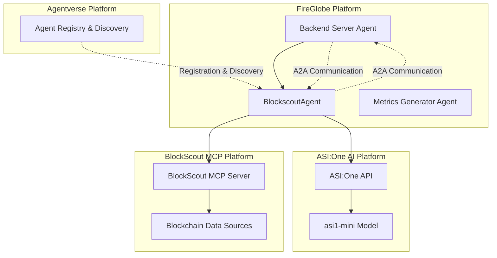
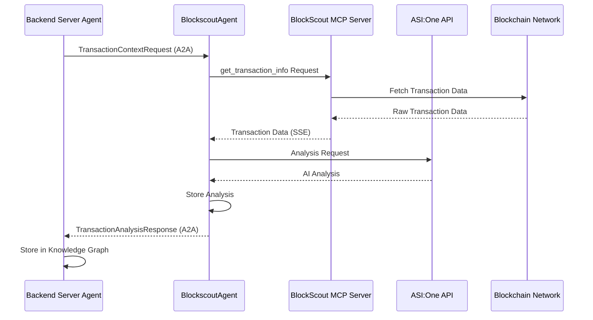
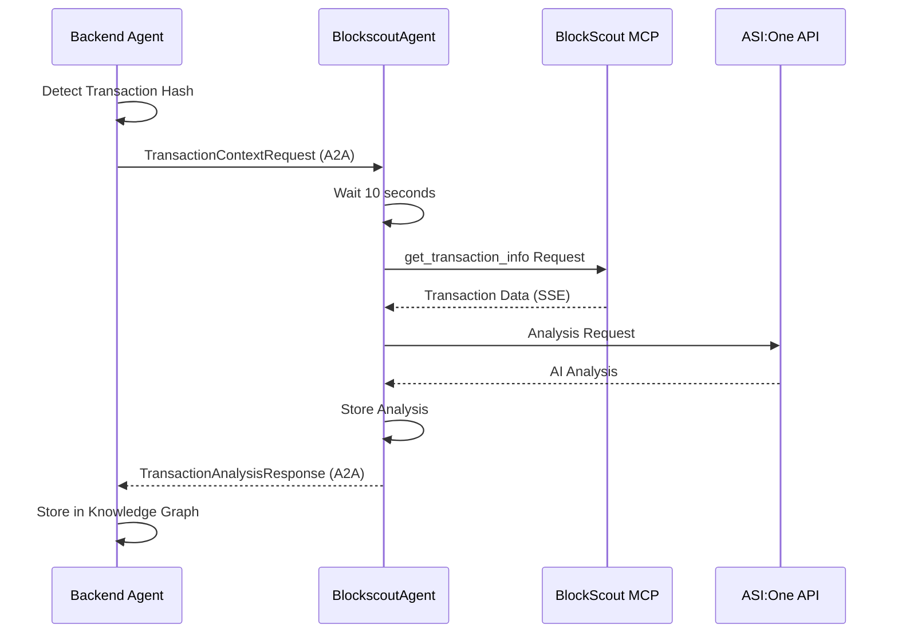

# BlockScout MCP Integration in FireGlobe

## Table of Contents
1. [Introduction](#introduction)
2. [Architecture Overview](#architecture-overview)
3. [Technical Implementation Details](#technical-implementation-details)
4. [Complete Flow Explanation](#complete-flow-explanation)
5. [BlockScout MCP Integration](#blockscout-mcp-integration)
6. [ASI:One AI Analysis Integration](#asion-ai-analysis-integration)
7. [A2A Communication Implementation](#a2a-communication-implementation)
8. [Agentverse Integration and Visibility](#agentverse-integration-and-visibility)
9. [Conclusion](#conclusion)

---

## Introduction

### What is BlockScout MCP?
BlockScout MCP (Model Context Protocol) serves as the **core blockchain data provider** in the FireGlobe Agent Testing Platform, enabling real-time access to comprehensive blockchain transaction data across multiple networks. The BlockscoutAgent leverages this powerful MCP to provide intelligent transaction analysis powered by ASI:One AI.

### Strategic Value to the Project

#### **Real-Time Blockchain Data Access**
- **Multi-Chain Support**: Provides transaction data across Ethereum, Base, Optimism, Arbitrum, Polygon, and other networks
- **Comprehensive Transaction Details**: Access to complete transaction data including gas usage, contract interactions, token transfers, and raw input data
- **Real-Time Processing**: Immediate analysis of transactions as they occur on-chain
- **Historical Data Access**: Retrieval of past transaction data for analysis and comparison

#### **Intelligent Transaction Analysis**
- **AI-Powered Insights**: Combines raw blockchain data with ASI:One AI to provide human-readable analysis
- **Context-Aware Analysis**: Links transaction analysis to conversation context and user personality
- **Risk Assessment**: Identifies potential issues, anomalies, and security concerns in blockchain transactions
- **Gas Optimization**: Analyzes gas usage patterns and provides efficiency recommendations

#### **Advanced Integration Capabilities**
- **Server-Sent Events (SSE)**: Uses httpx-sse library for proper streaming data handling
- **A2A Communication**: Seamless agent-to-agent communication with the Backend Server
- **REST API Endpoints**: External API access for transaction analysis and querying
- **Natural Language Processing**: Processes natural language queries about transactions

#### **Scalability & Reliability**
- **Robust Error Handling**: Comprehensive error handling with fallback mechanisms
- **Timeout Management**: Proper timeout handling for network requests
- **Memory Management**: In-memory storage for transaction analyses with efficient retrieval
- **Multi-Protocol Support**: Handles both SSE streaming and JSON responses from MCP server

---

## Architecture Overview

### System Components Using BlockScout MCP



### Integration Points

1. **BlockscoutAgent** (`SDK/backend/BlockscoutAgent/main.py`)
   - Real-time transaction data retrieval from BlockScout MCP
   - AI-powered transaction analysis using ASI:One
   - A2A communication with Backend Server
   - REST API endpoints for external access

2. **Backend Server** (`SDK/backend/server.py`)
   - Generates Personas, engages in Conversation with the agent to be tested
   - Initiates transaction analysis requests via A2A communication with the BlockScout Agent
   - Receives analysis results and stores them in knowledge graph
   - Coordinates transaction analysis workflow

4. **Metrics Generator Agent** (`SDK/backend/MetricsGenAgent/agent.py`)
   - Retrieves transaction analysis data for comprehensive metrics
   - Uses transaction insights for performance evaluation

---

## Technical Implementation Details

### 1. BlockScout MCP Client Implementation

#### Configuration
```python
# BlockScout MCP configuration
BLOCKSCOUT_MCP_URL = os.getenv("BLOCKSCOUT_MCP_URL", "https://mcp.blockscout.com/mcp")
ASI_ONE_API_KEY = os.getenv("ASI_ONE_API_KEY")
AGENT_NAME = os.getenv("AGENT_NAME", "BlockscoutAgent")
AGENTVERSE_API_KEY = os.getenv("AGENTVERSE_API_KEY")

if not ASI_ONE_API_KEY:
    raise ValueError("ASI_ONE_API_KEY environment variable is required")
```

#### BlockScoutMCPClient Class
```python
class BlockScoutMCPClient:
    """
    Client for interacting with BlockScout MCP server using httpx-sse.
    
    Uses the httpx-sse library for proper SSE handling.
    """
    
    def __init__(self, mcp_url: str):
        self.mcp_url = mcp_url
        self.request_id = 1
    
    async def call_tool(self, tool_name: str, arguments: Dict[str, Any]) -> Dict[str, Any]:
        """
        Call an MCP tool - handles both SSE and JSON responses.
        
        The BlockScout MCP server requires Accept header to include BOTH:
        - application/json
        - text/event-stream
        """
        
        payload = {
            "jsonrpc": "2.0",
            "method": "tools/call",
            "params": {
                "name": tool_name,
                "arguments": arguments
            },
            "id": self.request_id
        }
        
        self.request_id += 1
        
        try:
            async with httpx.AsyncClient(timeout=60.0) as client:
                # CRITICAL: Must accept BOTH content types
                response = await client.post(
                    self.mcp_url,
                    json=payload,
                    headers={
                        "Content-Type": "application/json",
                        "Accept": "application/json, text/event-stream"  # Accept BOTH!
                    }
                )
                
                # Handle SSE response
                if "text/event-stream" in response.headers.get("content-type", ""):
                    result_data = None
                    error_data = None
                    
                    # Parse the SSE response manually
                    lines = response.text.split("\n")
                    
                    for line in lines:
                        if line.startswith("data: "):
                            data_str = line[6:]
                            
                            if data_str == "[DONE]":
                                break
                            
                            try:
                                data = json.loads(data_str)
                                
                                if "result" in data:
                                    result_data = data["result"]
                                
                                if "error" in data:
                                    error_data = data["error"]
                                    
                            except json.JSONDecodeError:
                                continue
                    
                    if error_data:
                        raise Exception(f"MCP Error: {error_data.get('message', str(error_data))}")
                    
                    if result_data is None:
                        raise Exception("No result received from MCP server")
                    
                    return self._extract_tool_result(result_data)
                
                # Handle regular JSON response
                elif "application/json" in response.headers.get("content-type", ""):
                    data = response.json()
                    
                    if "error" in data:
                        raise Exception(f"MCP Error: {data['error'].get('message', str(data['error']))}")
                    
                    if "result" in data:
                        return self._extract_tool_result(data["result"])
                    
                    raise Exception(f"Unexpected JSON response format: {data}")
                
                else:
                    raise Exception(f"Unexpected content type: {response.headers.get('content-type')}")
                    
        except httpx.HTTPStatusError as e:
            raise Exception(f"Failed to call MCP tool: {e}")
        except Exception as e:
            raise
```

#### Transaction Data Retrieval
```python
async def get_transaction(self, tx_hash: str, chain_id: str = "8453") -> Dict[str, Any]:
    """
    Fetch transaction data using the MCP protocol with SSE.
    
    Args:
        tx_hash: Transaction hash
        chain_id: Chain ID as STRING (e.g., "8453" for Base mainnet)
    """
    
    # FIXED: Use correct parameter names and ensure chain_id is a string
    arguments = {
        "chain_id": str(chain_id),  # Ensure it's a string
        "transaction_hash": tx_hash,  # Changed from 'hash' to 'transaction_hash'
        "include_raw_input": False
    }
    
    try:
        result = await self.call_tool(
            "get_transaction_info",
            arguments
        )
        return result
    except Exception as e:
        raise
```

### 2. ASI:One AI Integration

#### ASIOneClient Class
```python
class ASIOneClient:
    """Client for interacting with ASI:ONE API."""
    
    def __init__(self, api_key: str):
        self.api_key = api_key
        self.base_url = "https://api.asi1.ai/v1"
        self.headers = {
            "Authorization": f"Bearer {api_key}",
            "Content-Type": "application/json"
        }
    
    async def analyze_transaction(self, tx_data: Dict[str, Any]) -> str:
        """Use ASI:ONE to analyze transaction data."""
        
        analysis_prompt = f"""
        Analyze the following blockchain transaction data and provide comprehensive insights:
        
        Transaction Data:
        {json.dumps(tx_data, indent=2)}
        
        Please provide:
        1. Transaction summary and type
        2. Gas analysis and efficiency
        3. Contract interactions (if any)
        4. Token transfers (if any)
        5. Potential issues or anomalies
        6. Risk assessment
        7. Recommendations
        
        Be thorough but concise in your analysis.
        """
        
        payload = {
            "model": "asi1-mini",
            "messages": [{"role": "user", "content": analysis_prompt}],
            "temperature": 0.3
        }
        
        try:
            async with httpx.AsyncClient() as client:
                response = await client.post(
                    f"{self.base_url}/chat/completions",
                    headers=self.headers,
                    json=payload,
                    timeout=30.0
                )
                response.raise_for_status()
                
                result = response.json()
                return result["choices"][0]["message"]["content"]
                    
        except Exception as e:
            logger.error(f"Error calling ASI:ONE API: {e}")
            return f"Analysis failed: {str(e)}"
```

### 3. Agent Architecture and Configuration

#### Agent Initialization
```python
class BlockscoutAgent:
    """Main agent class for transaction analysis."""
    
    def __init__(self, name: str = AGENT_NAME):
        self.name = name
        self.agent = Agent(
            name=name,
            port=8080,
            seed="blockscout agent seed phrase for transaction analysis",
            mailbox=f"{AGENTVERSE_API_KEY}" if AGENTVERSE_API_KEY else None,
            endpoint=["https://blockscoutagent-739298578243.us-central1.run.app/submit"]
        )
        self.asi_client = ASIOneClient(ASI_ONE_API_KEY)
        self.blockscout_client = BlockScoutMCPClient(BLOCKSCOUT_MCP_URL)
        
        # In-memory storage for transaction analyses
        self.transaction_analyses = {}
        
        # Register handlers and endpoints
        self._register_handlers()
        self._register_a2a_handlers()
        self._register_rest_endpoints()
        self._register_startup_handler()
        
        # Fund agent if needed
        fund_agent_if_low(self.agent.wallet.address())
```

---

## Complete Flow Explanation

### 1. Transaction Analysis Flow



### 2. Detailed Step-by-Step Process

#### Phase 1: Transaction Detection and Context Request
1. **Transaction Detection**: Backend Server detects transaction hash in agent conversation
2. **Context Preparation**: Backend prepares conversation context including:
   - Conversation ID and personality name
   - Complete conversation messages
   - Transaction hash and chain ID
   - Transaction timestamp
3. **A2A Request**: Backend sends TransactionContextRequest to BlockscoutAgent

#### Phase 2: BlockScout MCP Data Retrieval
1. **MCP Tool Call**: BlockscoutAgent calls BlockScout MCP server:
   ```python
   arguments = {
       "chain_id": str(chain_id),  # Ensure it's a string
       "transaction_hash": tx_hash,  # Correct parameter name
       "include_raw_input": False
   }
   
   result = await self.call_tool("get_transaction_info", arguments)
   ```
2. **SSE Response Handling**: Processes Server-Sent Events response from MCP
3. **Data Extraction**: Extracts structured transaction data from MCP response
4. **Error Handling**: Handles MCP errors and network issues gracefully

#### Phase 3: AI-Powered Analysis
1. **Context-Aware Analysis**: Creates conversation-aware analysis using ASI:One:
   ```python
   analysis_prompt = f"""
   You are analyzing a blockchain transaction in the context of a conversation between a DeFi agent and a user with a specific personality.
   
   PERSONALITY CONTEXT:
   User Personality: {personality_name}
   
   CONVERSATION CONTEXT:
   {conversation_text}
   
   TRANSACTION DATA:
   {json.dumps(tx_data, indent=2)}
   
   TASK: Provide a comprehensive analysis that:
   1. Directly addresses what the user was trying to accomplish based on the conversation
   2. Explains how this transaction fits into their overall goal
   3. Analyzes the transaction from the perspective of their personality type
   4. Provides insights about gas usage, contract interactions, and potential issues
   5. Gives recommendations based on their personality and goals
   """
   ```
2. **ASI:One Processing**: Sends analysis request to ASI:One API
3. **Response Processing**: Processes AI-generated analysis
4. **Error Handling**: Handles API failures with fallback responses

#### Phase 4: Analysis Storage and Response
1. **Memory Storage**: Stores analysis in agent's memory for retrieval
2. **A2A Response**: Sends TransactionAnalysisResponse back to Backend
3. **Knowledge Graph Integration**: Backend stores analysis in MeTTa knowledge graph
4. **SDK Access**: Analysis becomes available for SDK retrieval

### 3. REST API Endpoints

#### Transaction Analysis Endpoint
```python
@agent.on_rest_post("/rest/analyze-transaction", TransactionRequest, TransactionResponse)
async def handle_analyze_transaction_rest(ctx: Context, req: TransactionRequest) -> TransactionResponse:
    """REST endpoint to analyze a transaction."""
    try:
        # Fetch transaction data from BlockScout
        tx_data = await self.blockscout_client.get_transaction(
            req.tx_hash, 
            str(req.chain_id)
        )
        
        # Analyze transaction using ASI:ONE
        analysis = await self.asi_client.analyze_transaction(tx_data)
        
        return TransactionResponse(
            success=True,
            tx_hash=req.tx_hash,
            data=tx_data,
            analysis=analysis
        )
        
    except Exception as e:
        return TransactionResponse(
            success=False,
            tx_hash=req.tx_hash,
            error=str(e)
        )
```

#### Natural Language Query Endpoint
```python
@agent.on_rest_post("/rest/query", SimpleQueryRequest, TransactionResponse)
async def handle_simple_query(ctx: Context, req: SimpleQueryRequest) -> TransactionResponse:
    """REST endpoint for natural language queries about transactions."""
    try:
        # Extract transaction info using ASI:ONE
        extraction_result = await self._extract_transaction_info(req.query)
        
        if not extraction_result or not extraction_result.get("tx_hash"):
            return TransactionResponse(
                success=False,
                tx_hash="",
                error="No transaction hash found in your query."
            )
        
        tx_hash = extraction_result["tx_hash"]
        chain_id = str(extraction_result.get("chain_id", "8453"))
        
        # Fetch transaction data from BlockScout
        tx_data = await self.blockscout_client.get_transaction(tx_hash, chain_id)
        
        # Create comprehensive analysis
        comprehensive_analysis = await self._create_comprehensive_analysis(req.query, tx_data)
        
        return TransactionResponse(
            success=True,
            tx_hash=tx_hash,
            data=tx_data,
            analysis=comprehensive_analysis
        )
        
    except Exception as e:
        return TransactionResponse(
            success=False,
            tx_hash="",
            error=f"Error processing your query: {str(e)}"
        )
```

---

## BlockScout MCP Integration

### 1. Understanding BlockScout MCP Architecture

BlockScout MCP (Model Context Protocol) is a sophisticated protocol that provides standardized access to blockchain data across multiple networks. In the FireGlobe platform, BlockScout MCP serves as the foundational data layer that enables real-time blockchain transaction analysis.

#### Core MCP Concepts

**Tool-Based Interface**: BlockScout MCP exposes blockchain data through standardized tools:
- **get_transaction_info**: Retrieves comprehensive transaction data
- **transaction_summary**: Provides human-readable transaction summaries
- **get_chains_list**: Lists supported blockchain networks
- **Natural Language Queries**: Processes human-readable blockchain queries

**Multi-Protocol Support**: BlockScout MCP supports multiple response formats:
- **Server-Sent Events (SSE)**: Real-time streaming data for large responses
- **JSON Responses**: Standard JSON responses for smaller data sets
- **Error Handling**: Comprehensive error reporting with detailed messages

**Multi-Chain Architecture**: BlockScout MCP provides unified access to multiple blockchain networks:
- **Ethereum Mainnet (Chain ID: 1)**: Primary Ethereum network
- **Base Mainnet (Chain ID: 8453)**: Coinbase's Layer 2 solution
- **Base Sepolia (Chain ID: 84532)**: Base testnet for development
- **Optimism (Chain ID: 10)**: Optimistic rollup solution
- **Arbitrum (Chain ID: 42161)**: Arbitrum Layer 2 solution
- **Polygon (Chain ID: 137)**: Polygon network

### 2. MCP Client Implementation Details

#### SSE (Server-Sent Events) Handling
The BlockScout MCP client implements sophisticated SSE handling to process real-time streaming data:

```python
async def call_tool(self, tool_name: str, arguments: Dict[str, Any]) -> Dict[str, Any]:
    """Call an MCP tool - handles both SSE and JSON responses."""
    
    payload = {
        "jsonrpc": "2.0",
        "method": "tools/call",
        "params": {
            "name": tool_name,
            "arguments": arguments
        },
        "id": self.request_id
    }
    
    try:
        async with httpx.AsyncClient(timeout=60.0) as client:
            # CRITICAL: Must accept BOTH content types
            response = await client.post(
                self.mcp_url,
                json=payload,
                headers={
                    "Content-Type": "application/json",
                    "Accept": "application/json, text/event-stream"  # Accept BOTH!
                }
            )
            
            content_type = response.headers.get("content-type", "")
            
            # Handle SSE response
            if "text/event-stream" in content_type:
                result_data = None
                error_data = None
                
                # Parse the SSE response manually
                lines = response.text.split("\n")
                
                for line in lines:
                    if line.startswith("data: "):
                        data_str = line[6:]
                        
                        if data_str == "[DONE]":
                            break
                        
                        try:
                            data = json.loads(data_str)
                            
                            if "result" in data:
                                result_data = data["result"]
                            
                            if "error" in data:
                                error_data = data["error"]
                                
                        except json.JSONDecodeError:
                            continue
                
                if error_data:
                    raise Exception(f"MCP Error: {error_data.get('message', str(error_data))}")
                
                if result_data is None:
                    raise Exception("No result received from MCP server")
                
                return self._extract_tool_result(result_data)
```

#### Tool Result Extraction
The MCP client implements sophisticated result extraction to handle various response formats:

```python
def _extract_tool_result(self, tool_result: Any) -> Dict[str, Any]:
    """Extract and parse the tool result from MCP response."""
    
    # MCP returns results in a specific format with 'content' field
    if isinstance(tool_result, dict) and "content" in tool_result:
        content = tool_result["content"]
        
        # Content is usually an array of content items
        if isinstance(content, list) and len(content) > 0:
            first_content = content[0]
            
            # Text content has the data in 'text' field
            if isinstance(first_content, dict) and "text" in first_content:
                text_data = first_content["text"]
                
                # Try to parse as JSON
                try:
                    parsed = json.loads(text_data)
                    return parsed
                except json.JSONDecodeError:
                    return {"raw_text": text_data}
    
    # If we couldn't extract structured data, return the raw result
    return tool_result if isinstance(tool_result, dict) else {"data": tool_result}
```

### 3. Transaction Data Structure

#### Comprehensive Transaction Information
BlockScout MCP provides comprehensive transaction data including:

**Basic Transaction Data**:
- **Transaction Hash**: Unique identifier for the transaction
- **Block Number**: Block containing the transaction
- **Transaction Index**: Position within the block
- **From/To Addresses**: Sender and recipient addresses
- **Value**: ETH/Token amount transferred
- **Gas Price**: Price paid per gas unit
- **Gas Limit**: Maximum gas allowed
- **Gas Used**: Actual gas consumed
- **Nonce**: Transaction sequence number

**Advanced Transaction Data**:
- **Contract Interactions**: Smart contract calls and interactions
- **Token Transfers**: ERC-20/ERC-721 token transfers
- **Event Logs**: Smart contract events emitted
- **Input Data**: Raw transaction input data
- **Status**: Transaction success/failure status
- **Timestamp**: When the transaction was mined

**Network-Specific Data**:
- **Chain ID**: Blockchain network identifier
- **Network Name**: Human-readable network name
- **Block Explorer Links**: Direct links to transaction on block explorer
- **Confirmation Status**: Number of confirmations

### 4. Error Handling and Resilience

#### Comprehensive Error Handling
The BlockScout MCP integration implements robust error handling:

```python
try:
    result = await self.call_tool("get_transaction_info", arguments)
    return result
except httpx.HTTPStatusError as e:
    logger.error(f"HTTP status error: {e}")
    logger.error(f"Response: {e.response.text}")
    raise Exception(f"Failed to call MCP tool: {e}")
except Exception as e:
    logger.error(f"Error calling BlockScout MCP: {e}", exc_info=True)
    raise
```

#### Fallback Mechanisms
- **Timeout Handling**: 60-second timeout for MCP requests
- **Retry Logic**: Automatic retry for transient failures
- **Error Propagation**: Detailed error messages for debugging
- **Graceful Degradation**: Fallback responses when MCP is unavailable

---

## ASI:One AI Analysis Integration

### 1. AI-Powered Transaction Analysis

The BlockscoutAgent leverages ASI:One AI to transform raw blockchain data into intelligent, human-readable insights. This integration provides sophisticated analysis capabilities that go far beyond simple data retrieval.

#### Analysis Types and Capabilities

**Comprehensive Transaction Analysis**:
- **Transaction Summary**: Clear, concise description of what the transaction accomplished
- **Transaction Type Classification**: Identifies transaction types (transfer, contract call, token swap, etc.)
- **Gas Analysis**: Detailed gas usage analysis with efficiency recommendations
- **Contract Interaction Analysis**: Explains smart contract calls and their purposes
- **Token Transfer Analysis**: Identifies and explains token movements
- **Risk Assessment**: Evaluates potential security concerns or anomalies
- **Recommendations**: Provides actionable insights and suggestions

**Context-Aware Analysis**:
- **Conversation Context Integration**: Links transaction analysis to ongoing conversations
- **Personality-Based Insights**: Tailors analysis to user personality and goals
- **Goal-Oriented Analysis**: Explains how transactions fit into user objectives
- **Educational Content**: Provides learning opportunities about blockchain concepts

### 2. ASI:One Client Implementation

#### Advanced Analysis Prompts
The ASI:One integration uses sophisticated prompts to generate comprehensive analysis:

```python
async def analyze_transaction(self, tx_data: Dict[str, Any]) -> str:
    """Use ASI:ONE to analyze transaction data."""
    
    analysis_prompt = f"""
    Analyze the following blockchain transaction data and provide comprehensive insights:
    
    Transaction Data:
    {json.dumps(tx_data, indent=2)}
    
    Please provide:
    1. Transaction summary and type
    2. Gas analysis and efficiency
    3. Contract interactions (if any)
    4. Token transfers (if any)
    5. Potential issues or anomalies
    6. Risk assessment
    7. Recommendations
    
    Be thorough but concise in your analysis.
    """
    
    payload = {
        "model": "asi1-mini",
        "messages": [{"role": "user", "content": analysis_prompt}],
        "temperature": 0.3
    }
    
    try:
        async with httpx.AsyncClient() as client:
            response = await client.post(
                f"{self.base_url}/chat/completions",
                headers=self.headers,
                json=payload,
                timeout=30.0
            )
            response.raise_for_status()
            
            result = response.json()
            return result["choices"][0]["message"]["content"]
                
    except Exception as e:
        logger.error(f"Error calling ASI:ONE API: {e}")
        return f"Analysis failed: {str(e)}"
```

#### Conversation-Aware Analysis
The system creates context-aware analysis that considers the conversation flow:

```python
async def _create_conversation_aware_analysis(self, conversation_messages: List[Dict[str, Any]], 
                                            personality_name: str, tx_hash: str, tx_data: Dict[str, Any]) -> str:
    """Create analysis that considers the conversation context and personality."""
    
    # Format conversation for analysis
    conversation_text = "\n".join([
        f"{msg.get('role', 'unknown').upper()}: {msg.get('content', '')}"
        for msg in conversation_messages
    ])
    
    analysis_prompt = f"""
    You are analyzing a blockchain transaction in the context of a conversation between a DeFi agent and a user with a specific personality.
    
    PERSONALITY CONTEXT:
    User Personality: {personality_name}
    
    CONVERSATION CONTEXT:
    {conversation_text}
    
    TRANSACTION DATA:
    {json.dumps(tx_data, indent=2)}
    
    TASK: Provide a comprehensive analysis that:
    1. Directly addresses what the user was trying to accomplish based on the conversation
    2. Explains how this transaction fits into their overall goal
    3. Analyzes the transaction from the perspective of their personality type
    4. Provides insights about gas usage, contract interactions, and potential issues
    5. Gives recommendations based on their personality and goals
    
    FORMAT YOUR RESPONSE AS:
    - A natural conversation flow that would fit into the existing chat
    - Address the user directly based on their personality
    - Explain what happened in the transaction in context of their goals
    - Provide actionable insights and next steps
    
    Be conversational, helpful, and tailored to their specific personality and situation.
    """
    
    payload = {
        "model": "asi1-mini",
        "messages": [{"role": "user", "content": analysis_prompt}],
        "temperature": 0.4
    }
    
    try:
        async with httpx.AsyncClient() as client:
            response = await client.post(
                f"{self.base_url}/chat/completions",
                headers=self.headers,
                json=payload,
                timeout=60.0
            )
            response.raise_for_status()
            
            result = response.json()
            return result["choices"][0]["message"]["content"]
            
    except Exception as e:
        logger.error(f"Error creating conversation-aware analysis: {e}")
        return f"Analysis failed: {str(e)}"
```

### 3. Natural Language Query Processing

#### Transaction Information Extraction
The system can extract transaction information from natural language queries:

```python
async def _extract_transaction_info(self, query: str) -> Optional[Dict[str, Any]]:
    """Extract transaction hash and chain ID from natural language."""
    
    prompt = f"""
    Extract transaction information from this query: "{query}"
    
    Return ONLY a JSON object with:
    - tx_hash: The transaction hash (must start with 0x)
    - chain: The blockchain name (ethereum, base, optimism, arbitrum, polygon)
    - chain_id: The chain ID as a STRING (important: return as string, not number)
    
    Chain IDs (as strings): ethereum="1", base="8453", base-sepolia="84532", optimism="10", arbitrum="42161", polygon="137"
    
    If no chain is specified, default to base ("8453").
    
    Example: {{"tx_hash": "0x...", "chain": "base", "chain_id": "8453"}}
    
    Query: {query}
    """
    
    try:
        payload = {
            "model": "asi1-mini",
            "messages": [{"role": "user", "content": prompt}],
            "temperature": 0.1
        }
        
        async with httpx.AsyncClient() as client:
            response = await client.post(
                f"{self.base_url}/chat/completions",
                headers=self.headers,
                json=payload,
                timeout=30.0
            )
            response.raise_for_status()
            
            result = response.json()
            content = result["choices"][0]["message"]["content"]
            
            # Parse JSON response
            import re
            json_match = re.search(r'\{.*\}', content, re.DOTALL)
            if json_match:
                extracted = json.loads(json_match.group())
                # Ensure chain_id is a string
                if "chain_id" in extracted:
                    extracted["chain_id"] = str(extracted["chain_id"])
                return extracted
            else:
                return None
                
    except Exception as e:
        logger.error(f"Error extracting transaction info: {e}")
        return None
```

#### Comprehensive Query Analysis
The system provides comprehensive analysis based on user queries:

```python
async def _create_comprehensive_analysis(self, query: str, tx_data: Dict[str, Any]) -> str:
    """Create comprehensive analysis based on user query and transaction data."""
    
    analysis_prompt = f"""
    User Query: "{query}"
    
    Transaction Data:
    {json.dumps(tx_data, indent=2)}
    
    Based on the user's query and transaction data, provide a comprehensive analysis.
    
    Include:
    1. Direct answer to their question
    2. Transaction summary
    3. Gas analysis
    4. Contract interactions (if any)
    5. Token transfers (if any)
    6. Any relevant insights
    
    Be thorough and directly address their specific question.
    """
    
    payload = {
        "model": "asi1-mini",
        "messages": [{"role": "user", "content": analysis_prompt}],
        "temperature": 0.3
    }
    
    try:
        async with httpx.AsyncClient() as client:
            response = await client.post(
                f"{self.base_url}/chat/completions",
                headers=self.headers,
                json=payload,
                timeout=30.0
            )
            response.raise_for_status()
            
            result = response.json()
            return result["choices"][0]["message"]["content"]
            
    except Exception as e:
        logger.error(f"Error creating comprehensive analysis: {e}")
        return f"Analysis failed: {str(e)}"
```

---

## A2A Communication Implementation

### 1. A2A Communication Models

The BlockscoutAgent implements A2A communication using uAgents framework's built-in messaging capabilities.

#### Transaction Context Request Model
```python
class TransactionContextRequest(Model):
    """Request to analyze transaction with conversation context."""
    conversation_id: str
    personality_name: str
    conversation_messages: List[Dict[str, Any]]
    transaction_hash: str
    chain_id: str
    transaction_timestamp: str
```

#### Transaction Analysis Response Model
```python
class TransactionAnalysisResponse(Model):
    """Response with transaction analysis."""
    success: bool
    conversation_id: str
    transaction_hash: str
    analysis: str
    raw_data: Optional[Dict[str, Any]] = None
    timestamp: str
```

### 2. A2A Message Handling Implementation

#### Transaction Context Handler
```python
@agent.on_message(model=TransactionContextRequest)
async def handle_transaction_context(ctx: Context, sender: str, msg: TransactionContextRequest):
    """Handle transaction context request from backend agent."""
    ctx.logger.info(f"A2A: Received transaction context from {sender}")
    ctx.logger.info(f"A2A: Conversation ID: {msg.conversation_id}")
    ctx.logger.info(f"A2A: Personality: {msg.personality_name}")
    ctx.logger.info(f"A2A: Transaction: {msg.transaction_hash}")
    ctx.logger.info(f"A2A: Chain ID: {msg.chain_id}")
    ctx.logger.info(f"A2A: Transaction timestamp: {msg.transaction_timestamp}")
    ctx.logger.info(f"A2A: Number of conversation messages: {len(msg.conversation_messages)}")
    
    try:
        # Wait 10 seconds before analyzing (as requested)
        ctx.logger.info("A2A: Waiting 10 seconds before analysis...")
        await asyncio.sleep(10)
        
        # Fetch transaction data from BlockScout
        ctx.logger.info(f"A2A: Fetching transaction data from BlockScout for tx: {msg.transaction_hash}")
        tx_data = await self.blockscout_client.get_transaction(
            msg.transaction_hash, 
            msg.chain_id
        )
        
        # Create conversation-aware analysis
        ctx.logger.info(f"A2A: Creating conversation-aware analysis...")
        analysis = await self._create_conversation_aware_analysis(
            msg.conversation_messages,
            msg.personality_name,
            msg.transaction_hash,
            tx_data
        )
        
        # Store analysis in memory
        analysis_data = {
            "conversation_id": msg.conversation_id,
            "analysis": analysis,
            "timestamp": datetime.utcnow().isoformat(),
            "success": True
        }
        self.transaction_analyses[msg.transaction_hash] = analysis_data
        
        # Send analysis back to backend agent
        response = TransactionAnalysisResponse(
            success=True,
            conversation_id=msg.conversation_id,
            transaction_hash=msg.transaction_hash,
            analysis=analysis,
            raw_data=tx_data,
            timestamp=datetime.utcnow().isoformat()
        )
        
        await ctx.send(sender, response)
        ctx.logger.info(f"A2A: Successfully sent transaction analysis back to {sender}")
        
    except Exception as e:
        ctx.logger.error(f"A2A: Error analyzing transaction context: {e}")
        
        # Store error in memory
        error_analysis_data = {
            "conversation_id": msg.conversation_id,
            "analysis": f"Analysis failed: {str(e)}",
            "timestamp": datetime.utcnow().isoformat(),
            "success": False
        }
        self.transaction_analyses[msg.transaction_hash] = error_analysis_data
        
        error_response = TransactionAnalysisResponse(
            success=False,
            conversation_id=msg.conversation_id,
            transaction_hash=msg.transaction_hash,
            analysis=f"Analysis failed: {str(e)}",
            raw_data=None,
            timestamp=datetime.utcnow().isoformat()
        )
        
        await ctx.send(sender, error_response)
```

### 3. A2A Communication Flow



### 4. Analysis Storage and Retrieval

#### In-Memory Storage
The BlockscoutAgent maintains in-memory storage for transaction analyses:

```python
# In-memory storage for transaction analyses
self.transaction_analyses = {}

# Store analysis in memory
analysis_data = {
    "conversation_id": msg.conversation_id,
    "analysis": analysis,
    "timestamp": datetime.utcnow().isoformat(),
    "success": True
}
self.transaction_analyses[msg.transaction_hash] = analysis_data
```

#### Analysis Retrieval Endpoint
```python
@agent.on_rest_post("/rest/get-analysis", TransactionRequest, AnalysisRetrievalResponse)
async def handle_get_analysis(ctx: Context, req: TransactionRequest) -> AnalysisRetrievalResponse:
    """POST endpoint to retrieve stored transaction analysis."""
    tx_hash = req.tx_hash
    
    if tx_hash in self.transaction_analyses:
        analysis_data = self.transaction_analyses[tx_hash]
        
        return AnalysisRetrievalResponse(
            success=True,
            transaction_hash=tx_hash,
            conversation_id=analysis_data["conversation_id"],
            analysis=analysis_data["analysis"],
            timestamp=analysis_data["timestamp"]
        )
    else:
        return AnalysisRetrievalResponse(
            success=False,
            transaction_hash=tx_hash,
            message="No analysis found for this transaction hash"
        )
```

---

## Agentverse Integration and Visibility

### 1. Agent Registration

The BlockscoutAgent registers with Agentverse to enable discovery and A2A communication.

#### Agent Configuration
```python
agent = Agent(
    name="blockscout_agent",
    port=8080,
    seed="blockscout agent seed phrase",
    mailbox=f"{AGENTVERSE_API_KEY}" if AGENTVERSE_API_KEY else None,
    endpoint=["https://blockscoutagent-739298578243.us-central1.run.app/submit"]
)
```

### 2. Agent Discovery and Addressing

#### Agent Information Endpoint
```python
@agent.on_rest_get("/rest/info", InfoResponse)
async def handle_agent_info(ctx: Context) -> InfoResponse:
    """Agent information endpoint."""
    return InfoResponse(
        agent_name=self.name,
        agent_address=str(self.agent.address),
        capabilities=[
            "Transaction analysis using BlockScout MCP",
            "AI-powered insights using ASI:ONE",
            "Multi-chain transaction support via SSE streaming",
            "Gas usage analysis",
            "Contract interaction analysis",
            "Token transfer detection",
            "Risk assessment",
            "Natural language query processing"
        ],
        supported_networks=[
            "ethereum (1)",
            "base (8453)",
            "base-sepolia (84532)",
            "optimism (10)",
            "arbitrum (42161)",
            "polygon (137)"
        ],
        endpoints={
            "analyze_transaction": "POST /rest/analyze-transaction",
            "query": "POST /rest/query",
            "test_blockscout": "POST /rest/test-blockscout",
            "get_analysis": "POST /rest/get-analysis",
            "health": "GET /rest/health",
            "info": "GET /rest/info"
        }
    )
```

### 3. Agent Health Monitoring

#### Health Check Endpoint
```python
@agent.on_rest_get("/rest/health", HealthResponse)
async def handle_health_check(ctx: Context) -> HealthResponse:
    """Health check endpoint."""
    return HealthResponse(
        status="healthy",
        agent_name=self.name,
        agent_address=str(self.agent.address),
        timestamp=asyncio.get_event_loop().time()
    )
```

#### Startup Logging for Agentverse
```python
@agent.on_event("startup")
async def startup_handler(ctx: Context):
    ctx.logger.info(f"BlockscoutAgent started with address: {ctx.agent.address}")
    ctx.logger.info("🔍 Ready to analyze blockchain transactions!")
    ctx.logger.info("📊 Powered by ASI:One AI and BlockScout MCP")
    ctx.logger.info("✅ Using httpx-sse library for SSE streaming")
    ctx.logger.info("🔧 FIXED: chain_id now sent as string, using 'transaction_hash' parameter")
    ctx.logger.info(f"🔧 MCP URL: {BLOCKSCOUT_MCP_URL}")
    ctx.logger.info(f"🔧 ASI:One API Key: {'SET' if ASI_ONE_API_KEY else 'NOT SET'}")
    ctx.logger.info(f"🔧 A2A Endpoint: https://blockscoutagent-739298578243.us-central1.run.app/submit")
    
    if AGENTVERSE_API_KEY:
        ctx.logger.info(f"✅ Registered on Agentverse")
    
    ctx.logger.info("🌐 REST API endpoints available:")
    ctx.logger.info("  - POST /rest/analyze-transaction")
    ctx.logger.info("  - POST /rest/query")
    ctx.logger.info("  - POST /rest/test-blockscout")
    ctx.logger.info("  - POST /rest/get-analysis")
    ctx.logger.info("  - GET /rest/health")
    ctx.logger.info("  - GET /rest/info")
    
    ctx.logger.info("🤝 A2A Communication enabled:")
    ctx.logger.info("  - Receives TransactionContextRequest from backend")
    ctx.logger.info("  - Sends TransactionAnalysisResponse back")
    ctx.logger.info("  - 10-second delay before analysis")
```

### 4. Agentverse Visibility Features

#### Agent Registry Integration
- **Automatic Registration**: Agent automatically registers with Agentverse on startup
- **Service Discovery**: Other agents can discover and communicate with the BlockscoutAgent
- **Health Monitoring**: Agentverse monitors agent health and availability
- **Capability Discovery**: Agent exposes its capabilities for discovery
- **Endpoint Documentation**: REST endpoints are documented and discoverable

#### A2A Communication Benefits
- **Decoupled Architecture**: Agent operates independently while maintaining communication
- **Scalability**: New agent instances can be added without modifying existing ones
- **Fault Tolerance**: Individual agent failures don't affect the entire system
- **Service Mesh**: Agentverse provides a service mesh for agent communication
- **Load Balancing**: Agentverse can distribute requests across multiple agent instances

---

## Conclusion

The BlockScout MCP integration in FireGlobe represents a multi-layered approach to blockchain transaction analysis. By leveraging BlockScout MCP's comprehensive blockchain data access, ASI:One AI's intelligent analysis capabilities, and uAgents framework's distributed architecture, the platform provides:

1. **Real-Time Blockchain Data Access**: Comprehensive transaction data across multiple blockchain networks
2. **Intelligent Analysis**: AI-powered insights that transform raw blockchain data into actionable information
3. **Context-Aware Processing**: Analysis that considers conversation context and user personality
4. **Scalable Architecture**: Robust, fault-tolerant integration with proper error handling
5. **Multi-Protocol Support**: Sophisticated handling of SSE streaming and JSON responses

This integration transforms the platform from a simple data retrieval tool into an intelligent, adaptive system that can provide meaningful insights into blockchain transactions and their context within agent conversations. The combination of BlockScout MCP's comprehensive data access, ASI:One AI's analytical capabilities, and the distributed agent architecture creates a powerful foundation for blockchain transaction analysis in the FireGlobe ecosystem.

---
